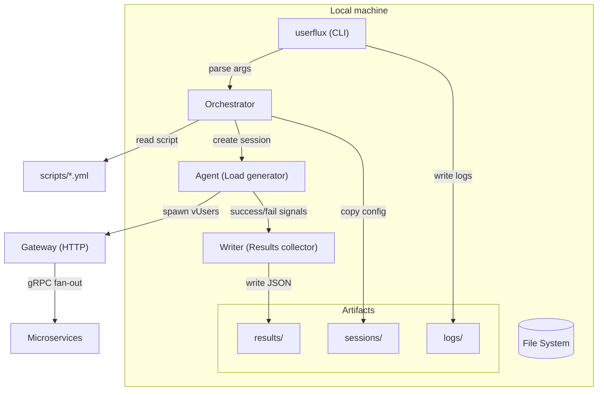
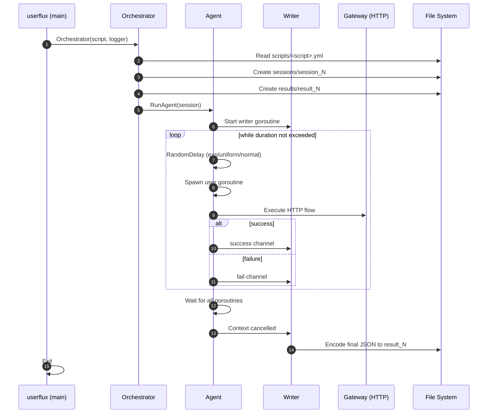
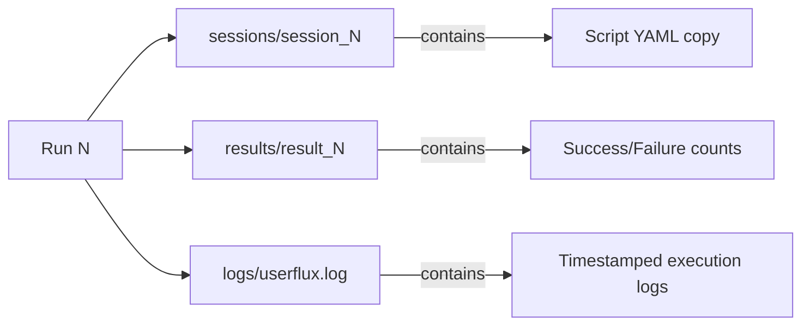

# Userflux — базовая архитектура (local-only)

## Контекст
Userflux генерирует нагрузку **только через Gateway по HTTP**. Gateway внутри делает fan-out по **gRPC** в микросервисы.  
На текущем этапе всё **локально**, без Prometheus/Postgres: результаты пишутся на диск, отчёты строятся Python-скриптами.

---

## 1) Контейнерная/компонентная схема (local-only)



---

## 2) Поток выполнения одного прогона (Run lifecycle)



---

## 3) Структура проекта

```
userflux/
├── cmd/
│   └── main.go                 # CLI entry point
├── internal/
│   ├── agent/
│   │   ├── agent.go            # Load generation logic
│   │   ├── helpers.go          # Random delay, body generation
│   │   └── writer.go           # Result aggregation
│   ├── logging/
│   │   └── logger.go           # Multi-writer logger (file + stderr)
│   ├── orchestrator/
│   │   └── orchestrator.go     # Script parsing, session management
│   └── session/
│       └── models.go           # Data structures
├── scripts/                    # YAML test scenarios
├── sessions/                   # Session configs (auto-created)
├── results/                    # JSON results (auto-created)
├── logs/                       # Log files (auto-created)
└── docs/
    └── architecture.md         # This file
```

---

## 4) Артефакты прогона (на диске)



### Формат result_N:
```json
{
  "Script": "register",
  "Total": 150,
  "Success": 148,
  "Failure": 2
}
```

---

## 5) Стратегии задержки между запросами

Agent поддерживает три режима генерации задержки (`RandomDelay`):

| Режим | Описание | Параметры |
|-------|----------|-----------|
| `uniform` | Равномерное распределение ±X% от base | `jitterFraction` = доля (0.3 = ±30%) |
| `exp` | Экспоненциальное распределение | `base` = среднее время |
| `normal` | Нормальное распределение (Box-Muller) | `jitterFraction` = стандартное отклонение как доля от base |

Все режимы поддерживают `min` и `max` для ограничения значений.

---

## 6) Ключевые принципы

- **Профиль нагрузки**: concurrency через goroutines + рандомизированные интервалы
- **Метрики**: локальная агрегация (Total, Success, Failure) через атомарные счётчики
- **Каналы**: успех/неудача передаются через buffered channels в Writer
- **Graceful shutdown**: контекст с таймаутом + ожидание всех goroutines через WaitGroup
- **Логирование**: dual-output (файл + stderr) с timestamps и source location

---

## 7) Текущие ограничения

- Нет поддержки ramp-up/ramp-down стадий
- Параметр `users` в конфиге пока не используется (запланировано)
- Нет расширенных метрик (latency p50/p95/p99, throughput)
- Python-аналитика ещё не реализована
- Результаты не включают временные метки отдельных запросов