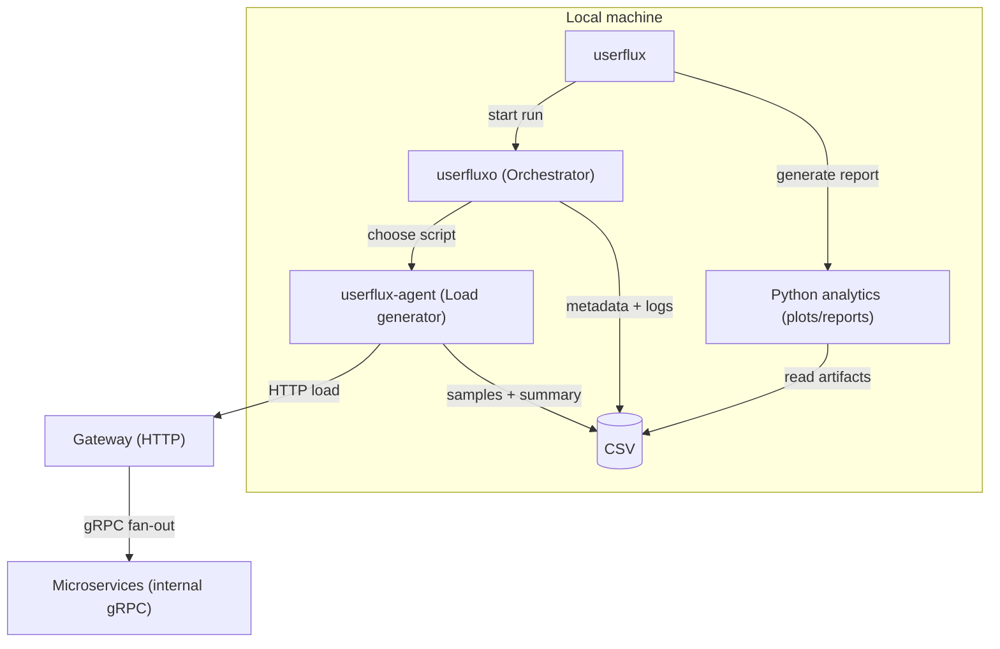
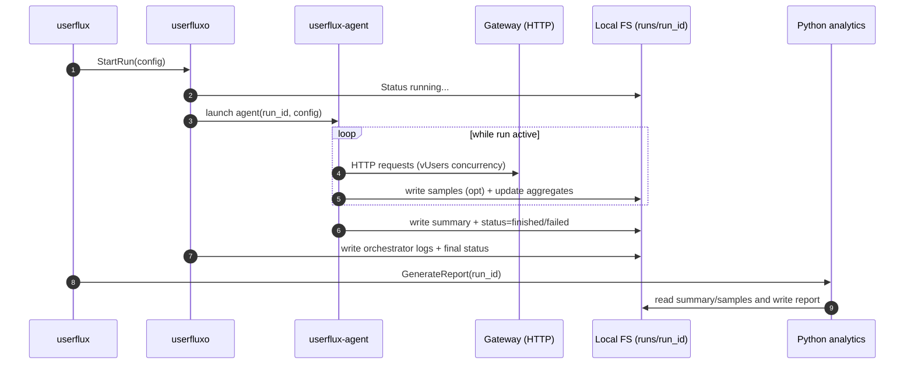
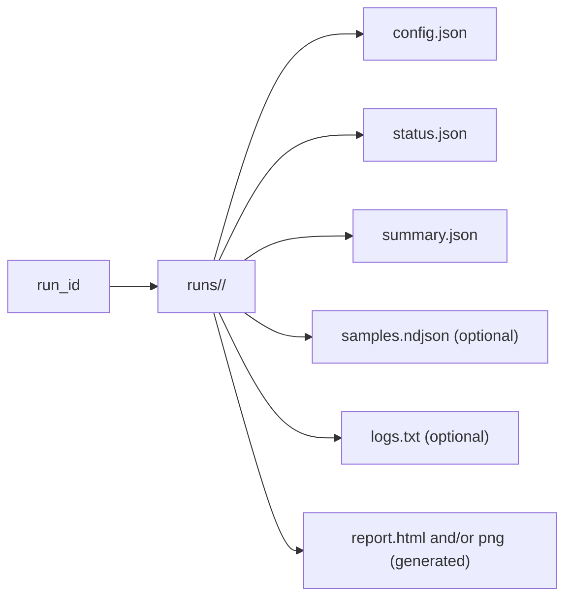

# Userflux — базовая архитектура (local-only)

## Контекст
Userflux генерирует нагрузку **только через Gateway по HTTP**. Gateway внутри делает fan-out по **gRPC** в микросервисы.  
На текущем этапе всё **локально**, без Prometheus/Postgres: результаты пишутся на диск, отчёты строятся Python-скриптами.

---

## 1) Контейнерная/компонентная схема (local-only)

---

## 2) Поток выполнения одного прогона (Run lifecycle)

---

## 3) Артефакты прогона (на диске)

---

## 4) Ключевые принципы (для текущего этапа)
- Профиль нагрузки: **concurrency (virtual users)** + стадии (ramp/hold).
- Метрики на старте: **локальная агрегация** (latency p50/p95/p99, error rate, throughput).
- `summary.json` — основной контракт результата для Python-аналитики.