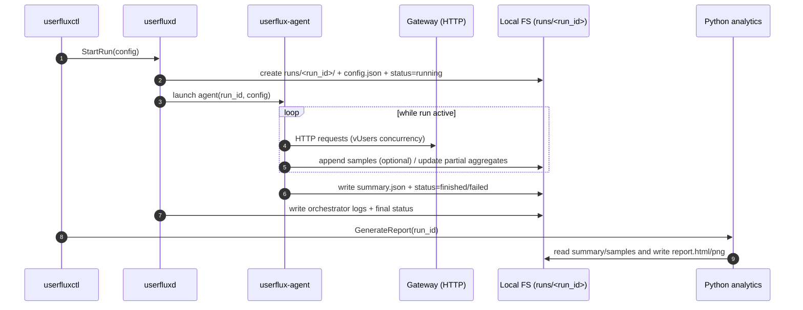

# Userflux

## Контекст
Userflux генерирует нагрузку **только через Gateway по HTTP** (как реальные пользователи). Gateway уже внутри распределяет вызовы по микросервисам через **gRPC**.  
На текущем этапе всё работает **локально**, без Prometheus/Postgres: результаты пишутся в файловую систему, отчёты строятся Python-скриптами.

---

## 1) Контейнерная/компонентная схема

```mermaid
flowchart TB
  subgraph DEV[Local machine]
    CLI[userfluxctl (CLI)]
    D[userfluxd (Orchestrator)]
    A[userflux-agent (Load generator)]
    FS[(Local FS: runs/<run_id>/)]
    PY[Python analytics (plots/reports)]
  end

  CLI -->|start run / status| D
  D -->|start run (local process)| A
  A -->|HTTP load| GW[Gateway (HTTP)]
  GW -->|gRPC fan-out| MS[Microservices (internal gRPC)]
  A -->|samples + summary| FS
  D -->|metadata + logs| FS
  PY -->|read artifacts| FS
  CLI -->|generate report| PY
```

---

## 2) Поток выполнения одного прогона (Run lifecycle)



---

## 3) Артефакты прогона (на диске)

```mermaid
flowchart LR
  RID[run_id] --> DIR[runs/<run_id>/]
  DIR --> CFG[config.json]
  DIR --> ST[status.json]
  DIR --> SUM[summary.json]
  DIR --> SAMP[samples.ndjson (optional)]
  DIR --> LOG[logs.txt (optional)]
  DIR --> REP[report.html / *.png (generated)]
```

---

## 4) Ключевые принципы (для текущего этапа)
- Нагрузка моделируется через **concurrency (virtual users)**: целевое число параллельных vUsers и стадии (ramp/hold).
- Метрики на старте: **локальная агрегация** (latency percentiles, error rate, throughput).
- Стабильный контракт результатов: `summary.json` (и опционально `samples.ndjson`) — источник для Python-аналитики.